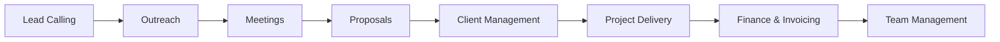
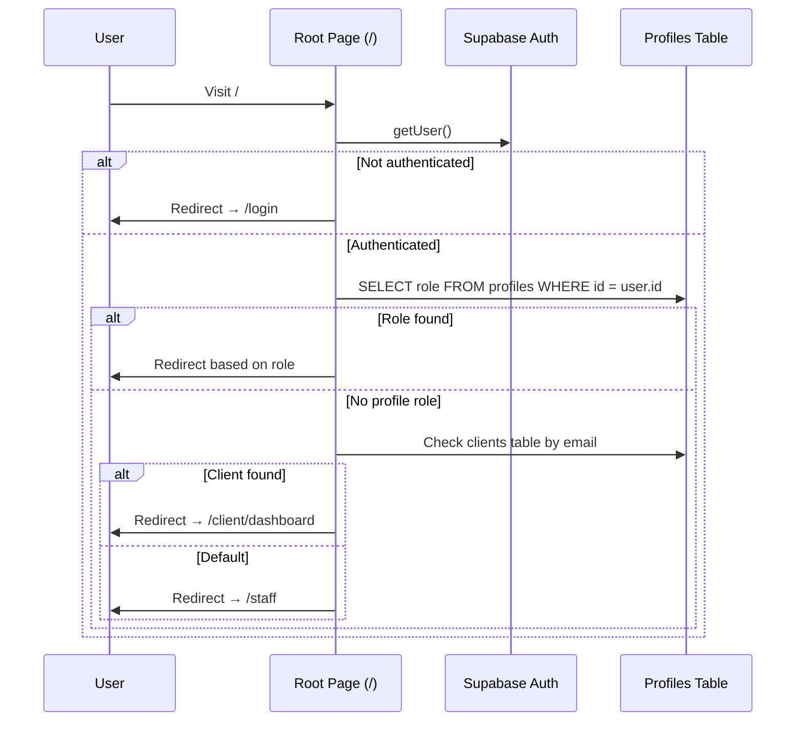
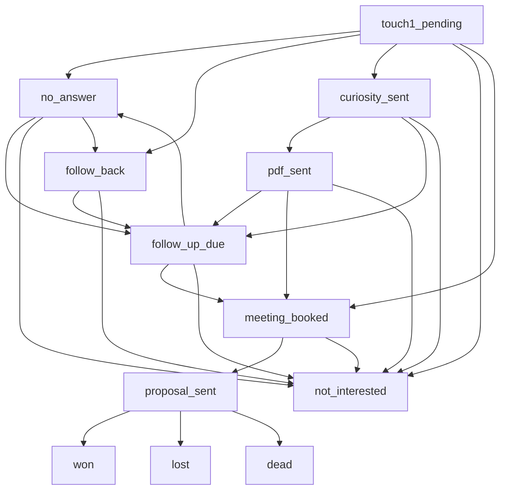

# FortuneMarq Agency OS (FMOS) — Complete Application Documentation

> **Last Updated:** June 12, 2026
> **Version:** 0.1.0 (app v4.8 — DB fully synced + inbound engine Stage 0)
> **Owner:** Jabeer (sayedjabir33@gmail.com)
> **App Name:** `agency-os`

> ⚠️ **2026-06-12 — major additions not yet folded into the chapters below**
> (see `COWORK_HANDOFF.md` + `00_MASTER_BUILD_PLAN.md` for detail):
> - **Database**: ALL pending migrations executed via `supabase/2026-06-12_full_schema_sync.sql`
>   (38 new tables incl. notifications, attendance_*, automation_*, ad_campaigns,
>   lead_source_attribution, inbound_events, ad_insights_daily, saved_views, niche_kits…).
>   `types/database.types.ts` regenerated (112 tables).
> - **Inbound engine (Phase F Stage 0)**: `lib/inbound/capture.ts` pipeline,
>   `POST /api/inbound/[channel]` webhook (INBOUND_WEBHOOK_SECRET), LP UTM capture,
>   cockpit source picker, `leads.source/lead_source/captured_at/first_contact_at`,
>   round-robin auto-assign (assignment_pools 'sales'), Inbound & Funnel tab on /admin/marketing.
> - **Team management**: `app/admin/team/user-actions.ts` (invite/role/password/deactivate/remove).
> - **Notifications**: bell + realtime live; `/api/cron/daily-digest`; all cron routes accept GET; `vercel.json` crons.
> - **Finance**: `recordInvoicePayment()` partial payments (`partially_paid` status, `payment_method`).
> - **UI**: `promptModal()` (`components/ui/prompt-modal.tsx`) replaced every `prompt()`/`alert()`.

---

## ⚡ Changelog — 2026-06-11 Evening (UI/UX Session)

Full detail in `COWORK_HANDOFF.md`. Supersedes older UI statements in this document:

| Area | Change |
|---|---|
| Design system | Brand tokens in `globals.css` (`brand-deep` #1E7A4F = text-safe green; `#42CA80` accents/fills only); fonts self-hosted via next/font; `tailwind.config.ts` deleted (was dead v3 config) |
| Layout shell | `layout-wrapper.tsx`: `h-dvh` shell, `<main>` is the only scroll container; all shell pages use `min-h-full` (not `min-h-screen`) |
| Leads columns | `leads` has no `updated_at`/`assigned_to` — code uses `last_activity_at`/`assigned_sales_exec`/`meeting_booked_at`; `pipeline.ts` helpers auto-stamp timestamps |
| PDFs | `InvoicePDF.tsx` redesigned; proposals + agreements print to PDF via `.print-area` + `<PrintButton />`; agreement has signature blocks |
| Restyled | Login (rebuilt), admin dashboard (neutral-first), 7 error pages, cockpit accents; no emoji in UI chrome |

## ⚡ Changelog — 2026-06-11 Hardening Session

The following supersedes older statements in this document (full detail in `last_session.md`):

| Area | Change |
|---|---|
| Route protection | `proxy.ts` is now deny-by-default: all routes require a session except `/login`, `/lp/*`, `/client/report/*`, `/api/*`. `/admin` is admin-only. |
| RLS | All `USING (true)` policies replaced by migration `20260611000000_harden_rls_policies.sql` — staff-only catch-all, admin-only finance/audit, scoped client-portal access. Helpers: `fmos_role()`, `fmos_is_staff()`, `fmos_client_id()`. |
| Supabase clients | New `lib/supabase-admin.ts` (`createAdminClient()`, service-role) for cron + public flows. All user-context API routes use `createServerClientWithCookies()`. The old anon `createServerClient()` from `lib/supabase.ts` is no longer used anywhere server-side. |
| Cron | All `/api/cron/*` routes require `Authorization: Bearer CRON_SECRET` via `lib/cron-auth.ts` (fail closed). |
| Pipeline | `lib/pipeline.ts` is the single source of truth for lead stages (17 stages, incl. parked: `unreachable`, `gatekeeper`, `gatekeeper_flagged`, `language_barrier`, `revival`). All stage writes go through `leadStageUpdate()` / `leadStatusUpdate()`, which keep `outreach_stage` and `status` in lockstep. The outreach board renders parked stages as drag-drop columns. |
| Errors | Global toast system (`components/ui/toast.tsx`, mounted in root layout) + `lib/mutate.ts`. High-traffic mutations capture errors and roll back optimistic state. |
| Audit | DB triggers (`20260611000002_audit_triggers.sql`) on 10 core tables write to `audit_logs` server-side. `ActivityTimeline` merges `activity_events` + `audit_logs`; mounted on lead profile and client overview. |
| Notifications | `components/ui/notification-bell.tsx` is now mounted (mobile header + floating desktop top-right). Duplicate `components/layout/notification-bell.tsx` deleted. |
| Performance | Hot-column indexes (`20260611000003_hot_column_indexes.sql`); `LeadsList` paginates at the DB (50/page); outreach board fetch fixed (now selects `updated_at`/`assigned_to`) and capped. |
| Meetings | `meeting_link` / `meeting_notes` are now a versioned migration (`20260611000001_leads_meeting_columns.sql`) and present in `database.types.ts`. |
| Public flows | Landing-page lead capture is validated + service-role; magic-link reports served by `app/api/public/client-report/[token]/route.ts`. |

⚠️ **The four `20260611*` migrations must be run in Supabase (in order) before deploy.** Required env: `SUPABASE_SERVICE_ROLE_KEY`, `CRON_SECRET`.

---

## Table of Contents

1. [Application Overview](#1-application-overview)
2. [Technology Stack](#2-technology-stack)
3. [Project Architecture](#3-project-architecture)
4. [Authentication & Role-Based Access](#4-authentication--role-based-access)
5. [Navigation & Layout System](#5-navigation--layout-system)
6. [Page-by-Page Documentation](#6-page-by-page-documentation)
   - 6.1 [Root Page `/`](#61-root-page-)
   - 6.2 [Login Page `/login`](#62-login-page-login)
   - 6.3 [Admin Dashboard `/admin`](#63-admin-dashboard-admin)
   - 6.4 [Sales / Telecaller Cockpit `/sales`](#64-sales--telecaller-cockpit-sales)
   - 6.5 [Outreach Board `/admin/outreach`](#65-outreach-board-adminoutreach)
   - 6.6 [Meetings Page `/admin/meetings`](#66-meetings-page-adminmeetings)
   - 6.7 [Proposals `/admin/proposals`](#67-proposals-adminproposals)
   - 6.8 [Proposal Creator `/admin/leads/[id]/proposal/new`](#68-proposal-creator-adminleadsidproposalnew)
   - 6.9 [Lead Profile `/admin/leads/[id]`](#69-lead-profile-adminleadsid)
   - 6.10 [Clients List `/admin/clients`](#610-clients-list-adminclients)
   - 6.11 [Client Profile `/admin/clients/[id]`](#611-client-profile-adminclientsid)
   - 6.12 [Tasks `/tasks`](#612-tasks-tasks)
   - 6.13 [Projects `/projects`](#613-projects-projects)
   - 6.14 [Finance Dashboard `/admin/finance`](#614-finance-dashboard-adminfinance)
   - 6.15 [Growth Hub `/admin/growth`](#615-growth-hub-admingrowth)
   - 6.16 [Team Management `/admin/team`](#616-team-management-adminteam)
   - 6.17 [Strategy Engine `/admin/strategy`](#617-strategy-engine-adminstrategy)
   - 6.18 [Strategist Dashboard `/strategist`](#618-strategist-dashboard-strategist)
   - 6.19 [Staff Dashboard `/staff`](#619-staff-dashboard-staff)
   - 6.20 [Telecaller Stats `/telecaller/my-stats`](#620-telecaller-stats-telecallermy-stats)
   - 6.21 [Client Portal `/client/dashboard`](#621-client-portal-clientdashboard)
   - 6.22 [Additional Admin Pages](#622-additional-admin-pages)
7. [Global Components](#7-global-components)
8. [Lead Type System (A/B/C/D)](#8-lead-type-system-abcd)
9. [Outreach Stage Pipeline](#9-outreach-stage-pipeline)
10. [Database Schema](#10-database-schema)
11. [Server Actions & API Routes](#11-server-actions--api-routes)
12. [Services Data Model](#12-services-data-model)
13. [Utility Libraries](#13-utility-libraries)
14. [Environment Configuration](#14-environment-configuration)
15. [Deployment & DevOps](#15-deployment--devops)

---

## 1. Application Overview

**FMOS** (FortuneMarq Marketing Operating System) is a full-stack CRM and project management platform built by and for **FortuneMarq**, a digital marketing agency based in Hubli, Karnataka, India.

### What It Covers
The application spans the **entire agency lifecycle**:



| Area | Purpose |
|---|---|
| **Lead Management** | CSV upload, manual add, A/B/C/D classification, niche scripts |
| **Telecaller Cockpit** | Power dialer, call scripts, outcome logging, follow-up scheduling |
| **Outreach Board** | Kanban-style pipeline with 13 stages (8 active + 5 closed) |
| **Meetings** | WhatsApp templates, browser notifications, pre-meeting intel, post-meeting flow |
| **Proposals** | 3-step consultative proposal builder with service selection, preview, and WhatsApp delivery |
| **Client Management** | Health scores, MRR tracking, onboarding checklists, asset vault, renewals |
| **Project Management** | Multi-project board, task assignment, milestone tracking, client deliverables |
| **Finance** | Invoice management, MRR/setup/one-time revenue split, P&L, GST reports, expense tracking |
| **Growth** | Agency's own marketing tracking (social media, SEO, acquisition campaigns) |
| **Team** | SOPs, scorecards, targets, task stats per team member |
| **Client Portal** | External-facing dashboard for clients to view progress, approve deliverables, view reports |
| **Strategy Engine** | Strategy-to-task engine for structured client strategy planning |

---

## 2. Technology Stack

| Layer | Technology | Version |
|---|---|---|
| **Framework** | Next.js (App Router) | 16.1.6 |
| **Language** | TypeScript | 5.x |
| **React** | React + React DOM | 19.2.0 |
| **Styling** | Tailwind CSS | v4 |
| **Database** | Supabase (PostgreSQL) | `cnwooodktqwvpzkucskm.supabase.co` |
| **Auth** | Supabase Auth (`@supabase/ssr`) | 0.8.0 |
| **Icons** | Lucide React | 0.556.0 |
| **Charts** | Recharts | 3.5.1 |
| **Animations** | Framer Motion | 12.23.25 |
| **PDF Generation** | `@react-pdf/renderer` | 4.3.2 |
| **CSV Parsing** | PapaParse | 5.5.3 |
| **File Upload** | react-dropzone | 15.0.0 |
| **Markdown** | react-markdown | 10.1.0 |
| **Utilities** | clsx, tailwind-merge, date-fns, nanoid, uuid | Latest |
| **Testing** | Playwright | 1.58.2 |
| **Fonts** | DM Sans, IBM Plex Sans, IBM Plex Mono (Google Fonts) | — |

### Dev Command
```bash
npm run dev  # Runs on 0.0.0.0 so accessible on same Wi-Fi from mobile
```

---

## 3. Project Architecture

### Directory Structure

```
fmos/
├── app/                    # Next.js App Router pages
│   ├── layout.tsx          # Root layout (fonts, session heartbeat, command palette)
│   ├── page.tsx            # Root redirect (auth check → role-based redirect)
│   ├── login/              # Authentication page
│   ├── admin/              # Admin-role pages (31 sub-routes)
│   │   ├── page.tsx        # Admin Morning Dashboard
│   │   ├── outreach/       # Outreach Kanban board
│   │   ├── meetings/       # Meetings management
│   │   ├── proposals/      # Proposals list
│   │   ├── leads/          # Lead profiles & proposal creator
│   │   ├── clients/        # Client management
│   │   ├── finance/        # Finance dashboard + sub-pages
│   │   ├── growth/         # Agency growth tracking
│   │   ├── team/           # Team management
│   │   ├── strategy/       # Strategy-to-task engine
│   │   ├── agreements/     # Service agreements
│   │   ├── settings/       # App settings
│   │   ├── upload/         # CSV lead upload
│   │   ├── users/          # User management
│   │   └── ... (20+ more)
│   ├── sales/              # Telecaller Cockpit (all roles)
│   ├── strategist/         # Strategist pipeline dashboard
│   ├── projects/           # Project management board
│   ├── tasks/              # Task board (role-aware)
│   ├── staff/              # Staff dashboard
│   ├── telecaller/         # Redirects to /sales
│   ├── client/             # Client portal
│   │   ├── dashboard/      # Client-facing project dashboard
│   │   └── report/         # Client performance reports
│   ├── attendance/         # Attendance tracking
│   ├── lp/                 # Landing pages
│   ├── manager/            # Manager views
│   └── api/                # API route handlers
│       ├── ai/             # AI endpoints
│       ├── attendance/     # Attendance API
│       ├── cron/           # Scheduled tasks
│       ├── export/         # Data export
│       ├── leads/          # Lead API
│       ├── notifications/  # Notification verification
│       ├── reports/        # Report generation
│       └── session/        # Session ping
├── components/             # Reusable React components
│   ├── ui/                 # Core UI (sidebar, command palette, notifications)
│   ├── admin/              # Admin-specific components
│   ├── sales/              # Sales/telecaller components
│   ├── proposals/          # Proposal builder components
│   ├── clients/            # Client components
│   ├── projects/           # Project management components
│   ├── tasks/              # Task board components
│   ├── strategist/         # Strategist pipeline components
│   ├── team/               # Team management components
│   ├── staff/              # Staff dashboard components
│   ├── dashboard/          # Dashboard widgets
│   ├── layout/             # Layout helpers (followup checker, notification bell)
│   └── session-heartbeat   # Session keep-alive component
├── actions/                # Server Actions
│   ├── upload-leads.ts     # CSV lead upload with duplicate detection
│   ├── bulk-actions.ts     # Bulk update/export operations
│   ├── delete-data.ts      # Data deletion
│   ├── analyze-data.ts     # Data analysis
│   └── reset-database.ts   # Database reset
├── lib/                    # Utility libraries
│   ├── supabase.ts         # Browser Supabase client
│   ├── supabase-server.ts  # Server Supabase client (cookie-based auth)
│   ├── audit.ts            # Audit logging
│   ├── notifications.ts    # Notification helper
│   ├── niche-scripts.ts    # Industry-specific call scripts
│   ├── pitch-engine.ts     # AI pitch generation
│   ├── lead-scoring.ts     # Lead scoring algorithm
│   ├── filtering.ts        # Filter utilities
│   ├── normalize.ts        # Data normalization
│   ├── performance.ts      # Performance metrics
│   ├── file-service.ts     # File upload/download
│   ├── openrouter.ts       # AI model integration
│   ├── project-utils.ts    # Project helper functions
│   └── utils.ts            # General utilities (cn function)
├── types/                  # TypeScript type definitions
│   ├── database.types.ts   # Auto-generated Supabase types (109K)
│   ├── marketing.types.ts  # Marketing-specific types
│   ├── view.ts             # View types
│   └── index.ts            # Type exports
├── hooks/                  # Custom React hooks
│   └── useBulkSelection.ts # Bulk checkbox selection hook
├── public/                 # Static assets (Logo.png, etc.)
├── scripts/                # Build/migration scripts
├── supabase/               # Supabase configuration
└── tests/                  # Playwright test suite
```

### Supabase Client Rules

> [!IMPORTANT]
> Two different Supabase client patterns are used depending on the rendering context:

| Context | Import | File |
|---|---|---|
| **Server Components / Server Actions** | `createServerClientWithCookies()` | `lib/supabase-server.ts` |
| **Client Components** | `createClient()` | `lib/supabase.ts` |

Never use `createServerClient` directly — always use the wrapper functions.

---

## 4. Authentication & Role-Based Access

### Authentication Flow



### Login Page (`/login`)

**File:** [page.tsx](file:///Users/fortunemarq/Desktop/FortuneMarq-Build/01_CRM_AND_TOOL/fmos/app/login/page.tsx)

| Element | Description |
|---|---|
| **Email Input** | Email field with `Mail` icon, placeholder "you@company.com" |
| **Password Input** | Password field with `Lock` icon, placeholder "••••••••" |
| **Sign In Button** | Green `#42CA80` button, shows loading spinner during auth |
| **Error Display** | Red alert banner with `AlertCircle` icon when credentials fail |
| **Auto-redirect** | If already logged in, automatically redirects to role-based dashboard |
| **Audit Logging** | Login events are logged to `audit_logs` table via `logAudit()` |
| **Background Effects** | Two gradient orbs (green `#42CA80`) + subtle grid pattern |

### Role Definitions

| Role | Route After Login | Sidebar Items | Description |
|---|---|---|---|
| `admin` | `/admin` | 13 items | Full system access — dashboard, leads, outreach, meetings, proposals, agreements, clients, tasks, projects, finance, growth, team, strategy |
| `telecaller` | `/sales` | 2 items | My Calls (telecaller cockpit), My Stats |
| `strategist` | `/strategist` | 1 item | Strategy Board (pipeline Kanban) |
| `pm` | `/projects` | 1 item | Project Dashboard |
| `staff` / `execution_specialist` | `/staff` | 2 items | My Tasks, My Profile |
| `client` | `/client/dashboard` | 1 item | Client portal — My Project |

---

## 5. Navigation & Layout System

### Root Layout

**File:** [layout.tsx](file:///Users/fortunemarq/Desktop/FortuneMarq-Build/01_CRM_AND_TOOL/fmos/app/layout.tsx)

The root layout wraps every page with:

1. **Google Fonts** — DM Sans (400-700), IBM Plex Sans (400-600), IBM Plex Mono (400-500)
2. **SessionHeartbeat** — Invisible component that pings `/api/session/ping` every 2 minutes to keep the session alive. Also pings on tab visibility change.
3. **CommandPalette** — Global search modal activated by `⌘K` / `Ctrl+K`
4. **LayoutWrapper** — Conditionally renders the sidebar based on the current route (hidden on `/login`)

### Sidebar Navigation

**File:** [app-sidebar.tsx](file:///Users/fortunemarq/Desktop/FortuneMarq-Build/01_CRM_AND_TOOL/fmos/components/ui/app-sidebar.tsx)

| Feature | Description |
|---|---|
| **Role-aware** | Fetches user profile on mount, shows different nav items per role |
| **Collapsible** | Desktop: "Collapse Sidebar" button toggles between 240px and 64px width |
| **Mobile responsive** | Hamburger menu button → full-screen overlay with slide-in sidebar |
| **Logo** | FortuneMarq logo (`/Logo.png`) with brand name text |
| **Quick Search** | "Quick Search..." trigger button that opens the Command Palette (`⌘K`) |
| **Active state** | Left green border (`#42CA80`) + darker background for current route |
| **User profile** | Avatar initial + name + role badge at bottom of sidebar |
| **Settings gear** | Settings icon button next to user profile |
| **Sign Out** | Red-tinted logout button that calls `supabase.auth.signOut()` → redirects to `/login` |
| **Body scroll lock** | When mobile sidebar is open, `document.body.style.overflow = "hidden"` |

### Admin Sidebar Items (13 total)

| # | Label | Route | Icon |
|---|---|---|---|
| 1 | Dashboard | `/admin` | LayoutDashboard |
| 2 | Leads | `/sales` | Phone |
| 3 | Outreach | `/admin/outreach` | GitBranch |
| 4 | Meetings | `/admin/meetings` | CalendarCheck |
| 5 | Proposals | `/admin/proposals` | FileText |
| 6 | Agreements | `/admin/agreements` | FileSignature |
| 7 | Clients | `/admin/clients` | Users |
| 8 | Tasks | `/tasks` | ListTodo |
| 9 | Projects | `/projects` | FolderKanban |
| 10 | Finance | `/admin/finance` | DollarSign |
| 11 | Growth | `/admin/growth` | TrendingUp |
| 12 | Team | `/admin/team` | Users |
| 13 | Strategy | `/admin/strategy` | Target |

---

## 6. Page-by-Page Documentation

### 6.1 Root Page `/`

**File:** [page.tsx](file:///Users/fortunemarq/Desktop/FortuneMarq-Build/01_CRM_AND_TOOL/fmos/app/page.tsx)

**Purpose:** Authentication gateway — checks if user is logged in and redirects to the appropriate role-based dashboard.

| Step | What Happens |
|---|---|
| 1 | Shows FortuneMarq logo with loading spinner |
| 2 | Checks authentication via `supabase.auth.getUser()` |
| 3 | If not authenticated → redirect to `/login` |
| 4 | If authenticated → fetches role from `profiles` table |
| 5 | If no role → checks `clients` table by email |
| 6 | Redirects to role-specific route (see role table above) |

**Status messages shown during loading:** "Initializing...", "Checking authentication...", "Loading your dashboard..."

**Error handling:** If Supabase config is missing, shows a red "Configuration Error" box.

---

### 6.2 Login Page `/login`

*(Covered in Section 4 above)*

---

### 6.3 Admin Dashboard `/admin`

**File:** [page.tsx](file:///Users/fortunemarq/Desktop/FortuneMarq-Build/01_CRM_AND_TOOL/fmos/app/admin/page.tsx)

**Purpose:** The admin's "Morning Dashboard" — pure operational intelligence. Shows everything the agency owner needs to see first thing in the morning.

#### Header
- **Greeting:** "Good Morning, Jabeer" with ☕ Coffee icon
- **Date:** Full date string (e.g., "Monday, 9 June")
- **Action count:** "X items need your attention" or "All clear — nothing urgent"
- **Daily Briefing button:** Green `#42CA80` button → links to `/admin/briefing`

#### Monthly Invoice Reminder
- Appears only on days 1–5 of each month when there are active clients
- Amber banner: "📋 Monthly invoices due. X active clients need invoices raised."
- **"Go to Finance" button** → links to `/admin/finance/invoices`

#### 5 KPI Cards (top row)

| KPI | Data Source | Icon | Color |
|---|---|---|---|
| **MRR This Month** | `invoices` table (revenue_type = 'mrr', status = 'paid', current month) | DollarSign | Emerald |
| **Outstanding** | `invoices` table (status IN 'unpaid', 'overdue') | AlertTriangle | Red (if any), Slate (if zero) |
| **Active Clients** | `clients` table (status = 'active') | Users | Blue |
| **Leads in Pipeline** | `leads` table (status NOT IN 'closed_won', 'closed_lost', 'disqualified') | Target | Purple |
| **Meetings Today** | `leads` table (outreach_stage = 'meeting_booked', follow_up_date = today) | CalendarDays | Indigo |

#### MRR Progress Bar
- Shows "MRR vs Target" — currently displays "build month" status since no target is set yet

#### Today's Action List (left column, 2/3 width)

6 action sections, each with colored header and count badge:

| Section | Color | Data | Actions |
|---|---|---|---|
| **Meetings Today** | Green | Leads with `outreach_stage = 'meeting_booked'` + today's date | "Open Lead" button → `/admin/leads/[id]` |
| **Follow-ups Due Today** | Teal | Leads with `outreach_stage = 'follow_up_due'` + `follow_up_date = today` | "Call" link (tel:) + "Profile" link |
| **Overdue Invoices** | Red | Invoices with `status = 'overdue'` | "View Invoice" → `/admin/finance`. Shows "🔥 PAUSE ADS" badge if 7+ days overdue |
| **Proposals Not Replied (48h+)** | Amber | Proposals with `status = 'sent'` and `sent_at > 48 hours ago` | "Open Proposal" → `/admin/leads/[id]` |
| **Tasks Due Today** | Indigo | Tasks with `due_date = today` and `status != 'completed'` | "Open Task" → `/tasks` |
| **Clients in Onboarding** | Purple | Clients with `status = 'onboarding'` | "Open Client" → `/admin/clients/[id]` |

#### Right Column (1/3 width)

**Pipeline Snapshot:**
- Bar chart visualization of leads by status
- 8 stages: New/Untouched → 1st Call Pending → Calling → Contacted → Qualified → Strategy Booked → Nurture → Proposal Sent
- Each stage is clickable → links to `/sales?stage=[key]`
- Shows count per stage with proportional progress bar

**Revenue Forecast Widget:**
- Async `<Suspense>` loaded component showing projected revenue

**Telecaller Activity Today:**
- 3 stats: Calls Made, Meetings Booked, PDFs Sent
- Data from `lead_outcomes` and `outreach_logs` tables

**Quick Actions (4 links):**
- Manage Users → `/admin/users`
- Finance Dashboard → `/admin/finance`
- All Tasks → `/tasks`
- Team SOPs → `/admin/team`

---

### 6.4 Sales / Telecaller Cockpit `/sales`

**Files:**
- [page.tsx](file:///Users/fortunemarq/Desktop/FortuneMarq-Build/01_CRM_AND_TOOL/fmos/app/sales/page.tsx) (Server component)
- [telecaller-cockpit.tsx](file:///Users/fortunemarq/Desktop/FortuneMarq-Build/01_CRM_AND_TOOL/fmos/components/sales/telecaller-cockpit.tsx) (Client component — 79,944 bytes)

**Purpose:** The primary calling interface. Shows ALL leads and provides scripts, outcome logging, and follow-up management. Available to **ALL roles** (not just telecallers).

#### Server Page Data Fetch
Fetches in parallel:
- All active leads (up to 2,000) with fields: id, company_name, contact_person, phone, industry, city, status, notes, lead_type, etc.
- Calls logged today (from `lead_outcomes`)
- PDFs sent today (from `outreach_logs`)
- Meetings booked today
- All distinct niches and cities (for filter dropdowns)
- Market insights (search volume by niche+city)

#### Cockpit Features

| Feature | Description |
|---|---|
| **Daily Stats Bar** | Shows: Calls Today, PDFs Sent, Meetings Booked, Follow-ups Logged |
| **Niche Filter** | Dropdown of all industries from leads data |
| **City Filter** | Dropdown of all cities from leads data |
| **A/B/C/D Type Filter** | Buttons between niche/city filters and search bar — filters by lead type |
| **Search Bar** | Full-text search across company names |
| **Tab Switching** | "All Leads" tab + "Follow-ups" tab (with count badge) |
| **Lead Cards** | Each lead shows: company name, contact person, phone, industry, city, lead type badge |
| **`+` Button** | Opens manual lead creation modal |

#### Lead Type A/B/C/D Filter
Derived automatically by `getLeadScriptType()`:

| Type | Condition | Visual |
|---|---|---|
| **A** | `serp_ranked = true` + `has_website = true` | Green badge |
| **B** | `serp_ranked = false` + `has_website = true` | Blue badge |
| **C** | `has_website = false` | Purple badge |
| **D** | `serp_ranked = false` + `has_website = false` (low-search niche) | Amber badge |

#### Call Script System
When a lead is selected, the cockpit shows an industry-specific call script from [niche-scripts.ts](file:///Users/fortunemarq/Desktop/FortuneMarq-Build/01_CRM_AND_TOOL/fmos/lib/niche-scripts.ts) (31,847 bytes). Scripts are personalized based on lead type A/B/C/D.

#### 7 Call Outcome Buttons

| Button | Outcome ID | Sets `outreach_stage` to |
|---|---|---|
| 📤 **Sent Curiosity** | CURIOUS | `curiosity_sent` |
| 📄 **Sent PDF** | PDF_SENT | `pdf_sent` |
| 📅 **Follow-up Booked** | FOLLOW_UP | `follow_up_due` |
| 📞 **Will Call Back** | FOLLOW_BACK | `follow_back` |
| ❌ **No Answer** | NO_ANSWER | `no_answer` |
| 🚫 **Not Interested** | NOT_INTERESTED | `not_interested` |
| 🤝 **Meeting Booked** | MEETING | `meeting_booked` |

After logging an outcome:
1. DB write to update lead's `outreach_stage`, `last_outcome`, `last_outreach_at`
2. `setLocalLeads()` immediately updates the UI (no page reload needed — `localLeads` pattern)
3. Activity event logged

#### Follow-up Tab
Shows leads where `outreach_stage` IN (`follow_up_due`, `no_answer`, `follow_back`).
- Each follow-up has a **multi-step script** based on the stage (3 steps + objection handlers + progress bar)
- Follow-up scripts are different for each `outreach_stage` value

#### Manual Add Lead Modal
- **`+` button** in header → opens form modal
- Fields: Company Name, Contact Person, Phone, Industry (datalist), City (datalist), Has Website, Website URL, GMB Link, SERP Ranked
- `saveNewLead()` function inserts to Supabase and adds to `localLeads`

---

### 6.5 Outreach Board `/admin/outreach`

**Files:**
- [page.tsx](file:///Users/fortunemarq/Desktop/FortuneMarq-Build/01_CRM_AND_TOOL/fmos/app/admin/outreach/page.tsx)
- [outreach-board-client.tsx](file:///Users/fortunemarq/Desktop/FortuneMarq-Build/01_CRM_AND_TOOL/fmos/app/admin/outreach/outreach-board-client.tsx)

**Purpose:** Kanban-style pipeline visualization of all leads by outreach stage.

#### 8 Active Columns

| Column | Color | Badge Color |
|---|---|---|
| Touch 1 Pending | Slate | Slate |
| No Answer | Gray | Gray |
| Follow Back | Yellow | Yellow |
| Curiosity Sent | Blue | Blue |
| PDF Sent | Indigo | Indigo |
| Follow-up Due | Amber | Amber |
| Meeting Booked | Green | Green |
| Proposal Sent | Purple | Purple |

#### 5 Closed Columns (collapsed by default)
Not Interested, Won, Lost, Dead, Revival

#### Filters Bar (sticky at top)
- **Search:** Company name text search
- **Niche Dropdown:** Filter by industry
- **City Dropdown:** Filter by city
- **Type Dropdown:** Filter by lead type (A/B/C/D)
- **Assignee Dropdown:** Filter by assigned team member

#### Card Features
Each lead card shows:
- Company name (clickable → `/admin/leads/[id]`)
- Industry + City
- Lead type badge (A/B/C/D) with color coding
- Days in current stage
- Assigned person's first name
- **Stalled indicator:** Orange left border + "⚠ Stalled Xd" badge if 7+ days in same stage

#### Quick Action Buttons (per-card, varies by stage)
| Stage | Action Button |
|---|---|
| Touch 1 Pending | WhatsApp link (opens `wa.me/`) |
| Curiosity Sent | Send PDF → lead profile |
| PDF Sent / Follow-up Due | Log Call → lead profile |
| Meeting Booked | Open Lead → lead profile |
| Proposal Sent | Open Proposal → lead profile |

#### Drag & Drop
- **Admin only:** Cards can be dragged between columns to change `outreach_stage`
- `cursor-grab` / `cursor-grabbing` visual feedback
- Green ring on target column during drag-over
- Updates Supabase + local state simultaneously

#### Additional Button
- **PDF Log** button → links to `/admin/outreach/pdf-log`

---

### 6.6 Meetings Page `/admin/meetings`

**Files:**
- [page.tsx](file:///Users/fortunemarq/Desktop/FortuneMarq-Build/01_CRM_AND_TOOL/fmos/app/admin/meetings/page.tsx)
- [meetings-client.tsx](file:///Users/fortunemarq/Desktop/FortuneMarq-Build/01_CRM_AND_TOOL/fmos/app/admin/meetings/meetings-client.tsx) (41,847 bytes)

**Purpose:** Manage all leads with `outreach_stage = 'meeting_booked'`.

#### Meeting Status Classification
Via `getMeetingStatus()`:
- **Overdue:** `follow_up_date` is in the past
- **Today:** `follow_up_date` is today
- **Upcoming:** `follow_up_date` is in the future

#### Features per Meeting Card

| Feature | Description |
|---|---|
| **Script Type Badge** | A/B/C/D badge derived from `getScriptType()` |
| **Browser Notifications** | `useEffect` + `setTimeout` triggers at 1 hour and 15 minutes before meeting |
| **WhatsApp Templates** | 3 types: Confirmation, 1h Reminder, 15-min Reminder. Click → expands dark preview panel → "Open in WhatsApp & Send" button. Meeting link embedded via `buildMsg()` |
| **Pre-meeting Intel Panel** | Script type badge, website/GMB/ranking status, opening strategy tip, pre-call checklist |
| **Meeting Notes** | Inline edit + save to `meeting_notes` column on the lead |
| **Meeting Link** | Save/edit meeting URL (Zoom/Google Meet) |

#### Post-Meeting Flow
1. Click "Attended" → notes capture modal opens
2. Enter meeting notes → "Confirm & Move to Proposals"
3. Lead's `outreach_stage` updated to `proposal_sent`
4. "Create Proposal" link appears → `/admin/leads/[id]/proposal/new`

#### Action Functions
- `handleAction` — General meeting action handler
- `confirmAttended` — Marks meeting as attended + updates stage
- `handleReschedule` — Reschedules meeting date
- `saveMeetingLink` — Saves meeting URL
- `saveMeetingNotes` — Saves notes to DB

---

### 6.7 Proposals `/admin/proposals`

**File:** [page.tsx](file:///Users/fortunemarq/Desktop/FortuneMarq-Build/01_CRM_AND_TOOL/fmos/app/admin/proposals/page.tsx)

**Purpose:** Lists all proposals and identifies leads that need proposals created.

#### "Awaiting Proposal" Section
- Shows at the top with amber styling + Clock icon
- Lists leads with `outreach_stage = 'proposal_sent'` that DON'T have a proposal record yet
- Each card shows: company name, industry, city, phone, meeting notes preview
- **"Create Proposal →"** button → links to `/admin/leads/[id]/proposal/new`

#### Proposals Table
| Column | Content |
|---|---|
| Proposal No | Mono font proposal number |
| Lead / Client | Company name (clickable → lead profile) + city |
| Services | Comma-separated service labels from JSONB |
| Setup | One-time setup fee in ₹ (INR) |
| Monthly | Monthly retainer in ₹/mo (green text) |
| Status | Badge: `draft` (slate), `sent` (blue), `confirmed` (green), `rejected` (red) |
| Created | Date created |
| Sent | Date sent |

---

### 6.8 Proposal Creator `/admin/leads/[id]/proposal/new`

**Files:**
- [page.tsx](file:///Users/fortunemarq/Desktop/FortuneMarq-Build/01_CRM_AND_TOOL/fmos/app/admin/leads/%5Bid%5D/proposal/new/page.tsx)
- [proposal-creator.tsx](file:///Users/fortunemarq/Desktop/FortuneMarq-Build/01_CRM_AND_TOOL/fmos/components/proposals/proposal-creator.tsx) (73,910 bytes)

**Purpose:** Full 3-step consultative proposal builder.

#### Step 1 — Service Selection

| Element | Description |
|---|---|
| **Service cards** | Grouped by layer: Foundation / Visibility / Engagement |
| **Each card** | Checkbox + tagline + expand chevron → shows: problem it solves, deliverables, timeline, ad spend warning |
| **Pricing inputs** | Setup fee + monthly retainer for each selected service |
| **Proposal meta** | Start date picker, validity period (3/5/7/14/30 days), personal note to client |
| **Right summary panel** | Sticky panel showing: total setup, total monthly, commitment badges |

#### 7 Available Services
(From [services_data.json](file:///Users/fortunemarq/Desktop/FortuneMarq-Build/01_CRM_AND_TOOL/fmos/lib/data/services_data.json)):

1. **WEBSITE** — Website Design & Development
2. **GMB** — Google My Business Optimization
3. **SEO** — Search Engine Optimization
4. **GOOGLE_ADS** — Google Ads Management
5. **META_ADS** — Meta (Facebook/Instagram) Ads
6. **WHATSAPP_MARKETING** — WhatsApp Business Marketing
7. **AI_AUTOMATIONS** — AI Automations & Workflows

#### Step 2 — Proposal Preview (consultative document)

The preview generates a professional multi-section document:

| Section # | Title | Content |
|---|---|---|
| 1 | **Branded Cover** | Dark gradient, headline tailored to A/B/C/D type via `LEAD_TYPE_COPY`, proposal metadata |
| 2 | **Understanding Your Situation** | 3 panels: "Where You Are Now", "What This Is Costing You", "Why Now" — personalized per lead type |
| 3 | **Growth Funnel** | Visual tapering funnel (5 stages: Attract → Capture → Nurture → Convert → Retain), selected services tagged onto relevant stages. 4-phase execution roadmap (Discovery → Strategy → Execution → Optimise & Scale) |
| 4 | **Why FortuneMarq** | 6 differentiators: "Typical Agency" vs "FortuneMarq" side-by-side comparison (from `DIFFERENTIATORS` constant) |
| 5 | **Service Deep-Dives** | Per selected service: Why You Need This + Our Approach (numbered steps) + What You Get In Detail (6-feature grid) + Why This Works + Timeline (from `SERVICE_DEEP` constant) |
| 6 | **Investment Table** | Dark header, alternating rows, green monthly total. Ad spend disclaimer if Google/Meta Ads selected |
| 7 | **How We Get Started** | 5-step onboarding flow |
| 8 | **Footer** | Dark footer with contact details |

#### Step 3 — Done (WhatsApp Delivery)

| Element | Description |
|---|---|
| **WhatsApp message** | Pre-formatted message displayed as dark green chat bubble |
| **Copy button** | Copies the message text to clipboard |
| **"Open WhatsApp"** | Deep link: `wa.me/91[phone]?text=[encoded message]` |
| **"Mark as Sent → Move Stage"** | Updates proposal status to `sent`, lead's `outreach_stage` to `proposal_sent` |

---

### 6.9 Lead Profile `/admin/leads/[id]`

**Files:**
- [page.tsx](file:///Users/fortunemarq/Desktop/FortuneMarq-Build/01_CRM_AND_TOOL/fmos/app/admin/leads/%5Bid%5D/page.tsx)
- [lead-profile-admin-client.tsx](file:///Users/fortunemarq/Desktop/FortuneMarq-Build/01_CRM_AND_TOOL/fmos/app/admin/leads/%5Bid%5D/lead-profile-admin-client.tsx) (35,930 bytes)

**Purpose:** Complete 360° view of a single lead with all outreach history, proposals, and actions.

#### Data Loaded (Server-side, in parallel)
- Full lead record (all columns)
- Outreach logs (with actor profile name)
- Proposals for this lead
- Agreements for this lead
- Market insight for lead's industry + city
- WhatsApp templates (for sending messages)

#### Props Passed to Client Component
- `lead` — Full lead object
- `outreachLogs` — All past outreach actions
- `proposals` — All proposals for this lead
- `agreements` — All agreements for this lead
- `marketInsight` — Search volume, competition data
- `whatsappTemplates` — Available message templates
- `isAdmin` — Whether current user is admin
- `userId` — Current user ID

---

### 6.10 Clients List `/admin/clients`

**File:** [page.tsx](file:///Users/fortunemarq/Desktop/FortuneMarq-Build/01_CRM_AND_TOOL/fmos/app/admin/clients/page.tsx)

**Purpose:** Master client list with health scores, MRR, and operational metrics.

#### 6 KPI Stat Cards

| Stat | Color | Data Source |
|---|---|---|
| Total Active Clients | Green `#42CA80` | `clients` WHERE status = 'active' |
| Total MRR | Blue | Sum of `client_packages.monthly_value` WHERE status = 'active' |
| Avg Health Score | Amber | Average of `client_packages.health_score` |
| Upsell Eligible | Purple | Count of `client_packages.upsell_eligible = true` |
| At Risk | Red | Count where `health_score < 60` |
| Renewals (30d) | Orange | Clients with `renewal_date` within next 30 days |

#### Header Buttons
- **"Renewals"** → links to `/admin/clients/renewals`
- **"Add Client"** → Opens `AddClientModal` component

#### Clients Table
- `ClientsTable` component with sorting, filtering, status badges
- Shows upsell attempt history

---

### 6.11 Client Profile `/admin/clients/[id]`

**File:** [page.tsx](file:///Users/fortunemarq/Desktop/FortuneMarq-Build/01_CRM_AND_TOOL/fmos/app/admin/clients/%5Bid%5D/page.tsx)

**Purpose:** Full client profile with 7 tabs covering all aspects of the relationship.

#### Header Card
- Business name + status badge (active/paused/churned)
- Package tier badge + Upsell opportunity badge (if eligible)
- Contact info: owner name, phone (clickable tel:), email (clickable mailto:)
- City, niche, health score stars
- Active services pills + monthly value (₹/mo)
- Start date + renewal date

#### 7 Tabs

| Tab | Component | Description |
|---|---|---|
| **Overview** | `OverviewTab` | Summary of client status, active projects, recent activity feed |
| **Onboarding** | `OnboardingTab` | Checklist of onboarding tasks per service, asset vault items |
| **Assets** | `AssetVaultTab` | Uploaded client assets (logos, brand guidelines, credentials) |
| **Projects** | `ProjectsTab` | All projects for this client with status and progress |
| **Finance** | `FinanceTab` | Invoices for this client, payment history |
| **Strategy** | `StrategyTab` | Strategy runs, AI-generated recommendations, team assignments |
| **Communications** | `CommunicationsTab` | Call logs + WhatsApp message history |

#### Data Loaded in Parallel
- Client record, onboarding items, assets, call logs, projects
- Onboarding tasks, asset vault items
- Strategy team, strategy runs
- Activity feed (from `activity_events` table)
- Invoices (from `getInvoicesByClient()`)
- WhatsApp logs (from `whatsapp_message_log` table)

---

### 6.12 Tasks `/tasks`

**File:** [page.tsx](file:///Users/fortunemarq/Desktop/FortuneMarq-Build/01_CRM_AND_TOOL/fmos/app/tasks/page.tsx)

**Purpose:** Task management board with role-based views.

#### Staff / Execution Specialist View
- `StaffTaskBoard` component (4-column Kanban)
- Shows only tasks assigned to the logged-in user
- Fetches: id, title, status, due_date, description, revision_notes, revision_count, project info, client name

#### Admin / PM View
- `TaskBoard` component (full task management)
- Shows ALL tasks across all projects
- Additional columns: priority, sop_content, assigned_to, section_tag, estimated_minutes
- Project list dropdown for filtering
- Assignee info (profile name)

---

### 6.13 Projects `/projects`

**File:** [page.tsx](file:///Users/fortunemarq/Desktop/FortuneMarq-Build/01_CRM_AND_TOOL/fmos/app/projects/page.tsx)

**Purpose:** Project management dashboard.

#### Data Loading
1. Fetches all projects with client relationship (joined on `clients` table)
2. Fetches all tasks ordered by due date
3. For projects without direct `client_id`, checks `deals` table to resolve client
4. Enriches projects with client info from deals

#### Rendered By
`PMDashboard` component with props:
- `projects` — Enriched project list with client data
- `tasks` — All tasks
- `clientResources` — Client resource items

---

### 6.14 Finance Dashboard `/admin/finance`

**File:** [page.tsx](file:///Users/fortunemarq/Desktop/FortuneMarq-Build/01_CRM_AND_TOOL/fmos/app/admin/finance/page.tsx)

**Purpose:** Complete financial overview with revenue split, invoicing, and P&L.

#### Auto-Actions on Load
- `autoMarkOverdueInvoices()` — Automatically marks past-due invoices as "overdue"

#### 5 KPI Cards

| KPI | Color Border | Data |
|---|---|---|
| MRR This Month | Indigo | Paid invoices with `revenue_type = 'mrr'` this month |
| Setup Fees | Emerald | Paid invoices with `revenue_type = 'setup_fee'` this month |
| One-Time Revenue | Violet | Paid invoices with `revenue_type = 'one_time'` this month |
| Total Revenue MTD | Green `#42CA80` | Sum of MRR + Setup + One-Time |
| Outstanding | Amber | Unpaid + overdue invoice totals |

#### Revenue Mix Bar
- Horizontal stacked bar showing MRR vs Setup Fees vs One-Time proportions
- Color-coded legend with ₹ amounts

#### Main Grid (left 8 cols + right 4 cols)

**Left Column:**
- **Revenue vs Expenses chart** — `FinanceChart` component (Recharts), trailing monthly comparison
- **Recent Invoices table** — 7 most recent invoices with columns: Invoice #, Client, Type (MRR/Setup/One-Time badge), Amount, Status badge

**Right Column:**
- **P&L This Month** — MRR + Setup + One-Time = Total Revenue − Expenses = Net
- **GST Summary Card** — Current quarter GST collected (18%), split into CGST+SGST
- **Overdue Card** — Red-bordered list of overdue invoices with days late + amount
- **Finance Tools** (dark card with 4 links):
  - P&L View → `/admin/finance/pnl`
  - Expense Audit → `/admin/finance/expenses`
  - Manage Invoices → `/admin/finance/invoices`
  - GST Report → `/admin/finance/gst`

---

### 6.15 Growth Hub `/admin/growth`

**File:** [page.tsx](file:///Users/fortunemarq/Desktop/FortuneMarq-Build/01_CRM_AND_TOOL/fmos/app/admin/growth/page.tsx)

**Purpose:** Track FortuneMarq's own marketing and client acquisition growth.

#### Two Tabs
- **Organic Presence** (default)
- **Client Acquisition**

#### Top Stats Row (always visible)
5 cards: Instagram Followers, LinkedIn Followers, Facebook Followers, GMB Views (MTD), Website Sessions (MTD) — each with % change indicator (green up / red down arrows)

#### Organic Tab
- **Organic Trend Chart** — `OrganicTrendChart` component
- **5 Platform Cards:** Instagram, LinkedIn, Facebook, Google My Business, Website/SEO
  - Each shows: current metric, output (posts MTD), last post date
  - "Manage →" link to platform-specific sub-page
- **Pending Tasks sidebar** — Tasks tagged `agency_growth` that aren't completed

#### Acquisition Tab
- **City Overview Table** — `CityOverviewTable` component
- **Active Campaigns Table** — `ActiveCampaignsTable` component

---

### 6.16 Team Management `/admin/team`

**File:** [page.tsx](file:///Users/fortunemarq/Desktop/FortuneMarq-Build/01_CRM_AND_TOOL/fmos/app/admin/team/page.tsx)

**Purpose:** Team overview with task stats, targets, and performance tracking.

#### Data Loaded
- All internal team profiles (excluding clients)
- All tasks with status and assignment data
- Task stats per member: active tasks, completed today, completed this week
- Team targets from `team_targets` table

#### Sub-routes
- `/admin/team/scorecards` — Individual performance scorecards
- `/admin/team/sops` — Standard Operating Procedures library

---

### 6.17 Strategy Engine `/admin/strategy`

**File:** [page.tsx](file:///Users/fortunemarq/Desktop/FortuneMarq-Build/01_CRM_AND_TOOL/fmos/app/admin/strategy/page.tsx)

**Purpose:** Strategy-to-task engine for structured client strategy planning.

#### Features
- Strategy review queue with archive
- Task generation from strategy outputs
- Strategy runs per client

---

### 6.18 Strategist Dashboard `/strategist`

**File:** [page.tsx](file:///Users/fortunemarq/Desktop/FortuneMarq-Build/01_CRM_AND_TOOL/fmos/app/strategist/page.tsx)

**Purpose:** Pipeline Kanban board for the strategist role.

#### Data Loaded
- Active leads in strategist pipeline (status IN: qualified, strategy_booked, strategy_completed, proposal_sent, contract_signed)
- Closed won leads (last 50)
- Closed lost leads (last 50)
- Recent call activities (last 200 from `lead_outcomes`)
- Needs Proposal: leads with `status = 'strategy_completed'`
- Needs Contract: proposals sent 3+ days ago without response

#### "Manage All Deals" Button
→ Links to `/strategist/deals`

---

### 6.19 Staff Dashboard `/staff`

**File:** [page.tsx](file:///Users/fortunemarq/Desktop/FortuneMarq-Build/01_CRM_AND_TOOL/fmos/app/staff/page.tsx)

**Purpose:** Personal task dashboard for staff/execution specialists.

#### Features
- Shows only tasks assigned to the logged-in user
- Filters from all tasks using `assigned_to === user.id`
- Includes project and client info (service_type, business_name)
- "Go to Advanced Task Manager →" link → `/tasks/list`
- Rendered by `StaffDashboard` component

---

### 6.20 Telecaller Stats `/telecaller/my-stats`

**Purpose:** Personal performance stats for telecallers showing calls made, meetings booked, PDFs sent, and conversion metrics.

---

### 6.21 Client Portal `/client/dashboard`

**File:** [page.tsx](file:///Users/fortunemarq/Desktop/FortuneMarq-Build/01_CRM_AND_TOOL/fmos/app/client/dashboard/page.tsx)

**Purpose:** External-facing dashboard where clients log in to see their project progress.

#### Authentication
- Matches user email against `clients.primary_email` to identify the client
- Shows error if no client account found

#### Multi-Project Support
- If client has multiple active projects, shows project tabs to switch between them
- Filters to `status IN ('not_started', 'in_progress')`

#### Live Progress Section
- Large percentage display (e.g., "73%")
- Milestone progress: "X / Y Milestones" completed
- Full-width progress bar (dark fill)
- Start date + estimated completion date

#### Artifacts & Deliverables Section
- Grid of deliverable cards with status badges (approved / pending_review / revision_requested)
- Each card shows title + status icon
- **"View" button** — Opens file URL in new tab
- **Approve button** (✅) — Marks deliverable as approved, notifies PM
- **Revision button** (⚠) — Opens textarea for revision feedback → "Submit Revision" button, notifies PM

#### Project Roadmap Section
- Numbered milestone list with completion states
- Completed milestones: green circle with checkmark + strikethrough text
- Current milestone: dark background with scale animation
- Future milestones: muted opacity

#### Right Sidebar
- **Performance Reports** — Links to published reports (by month, with magic link tokens)
- **Your Manager Card** — Shows PM name, initial avatar, "Project Success VP" title, "Send Message" button (mailto:)

---

### 6.22 Additional Admin Pages

| Route | Purpose |
|---|---|
| `/admin/agreements` | Service agreement management |
| `/admin/alerts` | Alert configuration and management |
| `/admin/attendance` | Employee attendance tracking |
| `/admin/audit-log` | System-wide audit trail viewer |
| `/admin/automations` | Workflow automation rules |
| `/admin/briefing` | Daily briefing generation |
| `/admin/build-tracker` | Development build progress tracking |
| `/admin/bulk-import` | Bulk data import interface |
| `/admin/data-management` | Data management tools |
| `/admin/duplicates` | Duplicate lead detection and merging |
| `/admin/marketing` | Marketing campaign management |
| `/admin/niche-kits` | Niche-specific resource kits |
| `/admin/operations` | Operations center |
| `/admin/reports` | Report generation |
| `/admin/sales` | Sales management view |
| `/admin/sessions` | Active session monitoring |
| `/admin/settings` | Application settings |
| `/admin/upload` | CSV lead upload interface |
| `/admin/users` | User account management |
| `/admin/whatsapp-templates` | WhatsApp message template editor |
| `/admin/work-hours` | Work hours tracking |
| `/admin/finance/invoices` | Invoice CRUD management |
| `/admin/finance/expenses` | Expense audit and tracking |
| `/admin/finance/gst` | GST report (quarterly breakdown) |
| `/admin/finance/pnl` | Profit & Loss statement view |

---

## 7. Global Components

### Command Palette (⌘K / Ctrl+K)

**File:** [command-palette.tsx](file:///Users/fortunemarq/Desktop/FortuneMarq-Build/01_CRM_AND_TOOL/fmos/components/ui/command-palette.tsx)

**Purpose:** Spotlight-style global search across all data.

| Feature | Detail |
|---|---|
| **Trigger** | `⌘K` (Mac) / `Ctrl+K` (Windows) — also triggered from sidebar "Quick Search..." button |
| **Keyboard nav** | `↑↓` to navigate, `↵` to select, `Esc` to close |
| **Debounced search** | 300ms debounce before firing queries |
| **Search scopes** | Leads, Clients, Projects, Tasks, WhatsApp logs (admin only) |
| **Role-scoping** | Telecallers can only search their assigned leads; Clients/Tasks restricted by role |
| **Recent searches** | Saved to `localStorage`, shown when palette is empty |
| **Common actions** | Quick-nav links: Command Hub, Sales Force, Operations Center, Financials Hub, Strategy Engine, Leads Management |
| **Result display** | Categorized with headers, icon + title + subtitle + optional badge |

### Notification Bell

**File:** [notification-bell.tsx](file:///Users/fortunemarq/Desktop/FortuneMarq-Build/01_CRM_AND_TOOL/fmos/components/ui/notification-bell.tsx)

| Feature | Detail |
|---|---|
| **Bell icon** | Animated swing animation when unread count > 0 |
| **Unread badge** | Red circle with count (caps at "9+") |
| **Dropdown** | 400px wide, max 20 notifications, categorized with icons and colors |
| **Real-time** | Supabase Realtime subscription on `notifications` table for current user |
| **Notification types** | task_assigned, follow_up_due, follow_up_overdue, lead_status_changed, deliverable_approval_requested, deliverable_approved, deliverable_revision, deal_closed, report_published, ai_insight, system |
| **Mark read** | Individual (click checkmark) or "Mark all as read" button |
| **Time stamps** | Relative time display via `date-fns` formatDistanceToNow |
| **View Details** | Each notification can have a link → clicking opens the linked page |

### Session Heartbeat

**File:** [session-heartbeat.tsx](file:///Users/fortunemarq/Desktop/FortuneMarq-Build/01_CRM_AND_TOOL/fmos/components/session-heartbeat.tsx)

- Invisible component rendered in root layout
- Pings `/api/session/ping` every 120 seconds (2 minutes) via `POST` with `keepalive: true`
- Also pings on `visibilitychange` event (when user returns to tab)
- Only pings when `document.visibilityState === 'visible'`

### Activity Timeline

**File:** [ActivityTimeline.tsx](file:///Users/fortunemarq/Desktop/FortuneMarq-Build/01_CRM_AND_TOOL/fmos/components/ActivityTimeline.tsx) (8,094 bytes)

Reusable timeline component for displaying chronological events with icons, timestamps, and descriptions.

### File Manager

**File:** [file-manager.tsx](file:///Users/fortunemarq/Desktop/FortuneMarq-Build/01_CRM_AND_TOOL/fmos/components/ui/file-manager.tsx) (14,307 bytes)

File upload and management component with drag-and-drop support via `react-dropzone`.

---

## 8. Lead Type System (A/B/C/D)

The lead type system classifies every lead into one of 4 categories based on their current digital presence. This classification drives:
- Which **call scripts** are shown in the telecaller cockpit
- Which **proposal copy** is generated (headlines, situation analysis)
- Which **services** are recommended
- How the **outreach strategy** is framed

| Type | Conditions | Script Focus | Color |
|---|---|---|---|
| **A** | `serp_ranked = true` AND `has_website = true` | Protect ranking, grow from strong position | Green |
| **B** | `serp_ranked = false` AND `has_website = true` | Website exists but not ranking — SEO opportunity | Blue |
| **C** | `has_website = false` | No website — build digital foundation first | Purple |
| **D** | `serp_ranked = false` AND `has_website = false` (low-search niche) | Visibility in low-search market | Amber |

**Implementation:** `getLeadScriptType(lead)` function in `telecaller-cockpit.tsx` derives the type from the `serp_ranked` and `has_website` boolean fields on each lead.

---

## 9. Outreach Stage Pipeline

The `outreach_stage` column on the `leads` table is the **single source of truth** for where a lead sits in the pipeline.

### Full Stage Map

| outreach_stage | Label | Outreach Board Column | Follow-up Queue? | Next Action |
|---|---|---|---|---|
| `touch1_pending` | Touch 1 Pending | ✅ Active | No | Make first call |
| `no_answer` | No Answer | ✅ Active | **YES** | Retry call |
| `follow_back` | Follow Back | ✅ Active | **YES** | Lead said they'll call back |
| `curiosity_sent` | Curiosity Sent | ✅ Active | No | Wait for response |
| `pdf_sent` | PDF Sent | ✅ Active | No | Follow up on PDF |
| `follow_up_due` | Follow-up Due | ✅ Active | **YES** | Make follow-up call |
| `meeting_booked` | Meeting Booked | ✅ Active | No | → appears in `/admin/meetings` |
| `proposal_sent` | Proposal Sent | ✅ Active | No | → appears in `/admin/proposals` |
| `not_interested` | Not Interested | ⛔ Closed | No | — |
| `won` | Won | ⛔ Closed | No | Convert to client |
| `lost` | Lost | ⛔ Closed | No | — |
| `dead` | Dead | ⛔ Closed | No | — |
| `revival` | Revival | ⛔ Closed | No | Re-engage |

### Stage Transitions



---

## 10. Database Schema

### Key Tables

#### `leads`
The central entity for the sales pipeline.

| Column | Type | Description |
|---|---|---|
| id | uuid | Primary key |
| company_name | text | Business name |
| contact_person | text | Contact person name |
| phone | text | Phone number |
| industry | text | Niche/industry |
| city | text | City |
| status | text | Legacy status field |
| lead_type | text | A/B/C/D classification |
| has_website | boolean | Whether they have a website |
| website_link | text | URL |
| gmb_link | text | Google My Business URL |
| serp_ranked | boolean | Whether they rank in search |
| serp_source | text | Where ranking was checked |
| tags | text[] | Array of tags |
| outreach_stage | text | **Source of truth** for pipeline position |
| last_outcome | text | Last call outcome |
| last_outreach_at | timestamp | Last contact timestamp |
| follow_up_date | timestamp | Scheduled follow-up date/time |
| notes | text | General notes |
| no_answer_count | integer | Times no answer was received |
| meeting_link | text | Meeting URL (Zoom/Meet) |
| meeting_notes | text | Notes from meeting |
| assigned_sales_exec | uuid | FK to profiles |
| import_batch_id | text | CSV upload batch ID |
| source | text | Lead source |

#### `proposals`
| Column | Type | Description |
|---|---|---|
| id | uuid | Primary key |
| lead_id | uuid | FK to leads |
| proposal_number | text | Display number |
| services | jsonb | Array of selected services with pricing |
| total_setup | numeric | Total one-time setup fee |
| total_monthly | numeric | Total monthly retainer |
| status | text | draft / sent / confirmed / rejected |
| created_by | uuid | FK to profiles |
| created_at | timestamp | Creation time |
| sent_at | timestamp | When sent to client |
| start_date | date | Proposed start date |

#### `profiles`
| Column | Type | Description |
|---|---|---|
| id | uuid | Primary key (matches auth.users.id) |
| full_name | text | Display name |
| email | text | Email address |
| role | text | admin / telecaller / strategist / pm / staff / execution_specialist |

#### `clients`
| Column | Type | Description |
|---|---|---|
| id | uuid | Primary key |
| business_name | text | Client business name |
| primary_email | text | Email (used for client portal login matching) |
| phone | text | Phone number |
| owner_name | text | Business owner name |
| city | text | City |
| niche | text | Industry niche |
| status | text | active / paused / churned / onboarding |
| health_score | integer | 1-5 health rating |
| monthly_value | numeric | Monthly retainer value |
| package_tier | text | Service package tier |
| services_active | jsonb | Currently active services |
| start_date | date | Client start date |
| renewal_date | date | Next renewal date |
| upsell_eligible | boolean | Flagged for upsell |

#### `invoices`
| Column | Type | Description |
|---|---|---|
| id | uuid | Primary key |
| invoice_number | text | Display number |
| client_id | uuid | FK to clients |
| amount | numeric | Invoice amount (pre-GST) |
| total_amount | numeric | Total with GST |
| gst_amount | numeric | GST component |
| revenue_type | text | mrr / setup_fee / one_time |
| status | text | unpaid / paid / overdue / cancelled |
| due_date | date | Payment due date |
| issue_date | date | Invoice issue date |

#### `tasks`
| Column | Type | Description |
|---|---|---|
| id | uuid | Primary key |
| title | text | Task title |
| description | text | Task description |
| status | text | Task status (kanban column) |
| priority | text | Priority level |
| due_date | date | Due date |
| assigned_to | uuid | FK to profiles |
| project_id | uuid | FK to projects |
| client_id | uuid | FK to clients |
| sop_content | text | Standard operating procedure |
| section_tag | text | Section categorization |
| estimated_minutes | integer | Time estimate |
| revision_notes | text | Client revision feedback |
| revision_count | integer | Number of revisions |

#### `projects`
| Column | Type | Description |
|---|---|---|
| id | uuid | Primary key |
| name | text | Project name |
| service_type | text | Service category |
| status | text | not_started / in_progress / completed |
| client_id | uuid | FK to clients |
| deal_id | uuid | FK to deals |
| deadline | date | Project deadline |
| start_date | date | Start date |
| assigned_pm | uuid | FK to profiles (project manager) |

#### Other Tables

| Table | Purpose |
|---|---|
| `activity_events` | Audit trail: lead_id, user_id, event_type, stage_from, stage_to, notes |
| `audit_logs` | System-wide audit: actor_id, action, entity_type, entity_id, before_data, after_data |
| `lead_outcomes` | Call outcome records linked to leads |
| `outreach_logs` | Outreach touch records (PDF sent, WhatsApp, etc.) |
| `client_packages` | Active service packages per client with health_score, monthly_value |
| `client_onboarding_tasks` | Onboarding checklist items per client |
| `client_asset_vault` | Uploaded client assets (logos, credentials, etc.) |
| `client_deliverables` | Deliverables requiring client approval |
| `client_reports` | Published performance reports for clients |
| `client_resources` | Client resource files |
| `project_milestones` | Milestone tracking per project |
| `notifications` | In-app notification records (real-time via Supabase Channels) |
| `market_insights` | Industry + city search volume data |
| `team_targets` | Team performance targets |
| `expenses` | Business expenses for P&L |
| `whatsapp_message_log` | WhatsApp message audit trail |
| `whatsapp_templates` | Reusable WhatsApp message templates |
| `upsell_attempts` | Client upsell attempt records |
| `deals` | Deal tracking (links leads to clients) |
| `agreements` | Service agreements |

---

## 11. Server Actions & API Routes

### Server Actions (`/actions/`)

| File | Function | Description |
|---|---|---|
| [upload-leads.ts](file:///Users/fortunemarq/Desktop/FortuneMarq-Build/01_CRM_AND_TOOL/fmos/actions/upload-leads.ts) | `uploadLeads()` | Batch CSV upload with duplicate detection (name + phone normalization). Inserts in batches of 50. Returns `{ addedCount, skippedCount }` |
| [bulk-actions.ts](file:///Users/fortunemarq/Desktop/FortuneMarq-Build/01_CRM_AND_TOOL/fmos/actions/bulk-actions.ts) | `bulkUpdateEntity()` | Bulk update any entity type (lead/deal/project/task) by IDs. Logs audit for each record. |
| [delete-data.ts](file:///Users/fortunemarq/Desktop/FortuneMarq-Build/01_CRM_AND_TOOL/fmos/actions/delete-data.ts) | Various delete functions | Data deletion with safety checks |
| [analyze-data.ts](file:///Users/fortunemarq/Desktop/FortuneMarq-Build/01_CRM_AND_TOOL/fmos/actions/analyze-data.ts) | Data analysis | Analytics and data processing |
| [reset-database.ts](file:///Users/fortunemarq/Desktop/FortuneMarq-Build/01_CRM_AND_TOOL/fmos/actions/reset-database.ts) | `resetDatabase()` | Full database reset (development only) |

### API Routes (`/app/api/`)

| Route | Purpose |
|---|---|
| `/api/ai/*` | AI-powered features (OpenRouter integration) |
| `/api/attendance/*` | Attendance tracking endpoints |
| `/api/cron/*` | Scheduled task handlers |
| `/api/export/*` | CSV/data export endpoints |
| `/api/leads/*` | Lead management API |
| `/api/notifications/verify` | Verifies follow-up notifications are current |
| `/api/reports/*` | Report generation |
| `/api/session/ping` | Session heartbeat receiver |

---

## 12. Services Data Model

Services are defined in [services_data.json](file:///Users/fortunemarq/Desktop/FortuneMarq-Build/01_CRM_AND_TOOL/fmos/lib/data/services_data.json) with full details per service.

### 7 Services

| ID | Service Name | Category |
|---|---|---|
| `WEBSITE` | Website Design & Development | Foundation |
| `GMB` | Google My Business Optimization | Foundation |
| `SEO` | Search Engine Optimization | Visibility |
| `GOOGLE_ADS` | Google Ads Management | Visibility |
| `META_ADS` | Meta (Facebook/Instagram) Ads | Engagement |
| `WHATSAPP_MARKETING` | WhatsApp Business Marketing | Engagement |
| `AI_AUTOMATIONS` | AI Automations & Workflows | Engagement |

### Proposal Content Constants (in `proposal-creator.tsx`)

| Constant | Content |
|---|---|
| `SERVICE_DEEP` | Deep-dive content per service: `problem`, `ourApproach` (steps), `whyItWorks`, `features` (6 per service with title + detail) |
| `LEAD_TYPE_COPY` | A/B/C/D personalised content: `headline`, `situation` (with `{company}` placeholder), `consequence`, `urgency` |
| `DIFFERENTIATORS` | 6 "Typical Agency vs FortuneMarq" comparisons |
| `FUNNEL_STAGES` | Maps services to funnel stages: Attract → Capture → Nurture → Convert → Retain |

---

## 13. Utility Libraries

### Audit Logging

**File:** [audit.ts](file:///Users/fortunemarq/Desktop/FortuneMarq-Build/01_CRM_AND_TOOL/fmos/lib/audit.ts)

```typescript
logAudit({
  action: 'create' | 'update' | 'delete' | 'login' | 'logout' | 'export' | 'stage_change',
  resourceType: 'lead' | 'client' | 'task' | 'template' | 'niche_kit' | 'deliverable' | 'report' | 'profile',
  resourceId?: string,
  resourceLabel?: string,
  oldValue?: any,
  newValue?: any
})
```

Writes to `audit_logs` table with: actor_id (from session), action, entity_type, entity_id, before_data, after_data.

### Key Utility Files

| File | Description |
|---|---|
| [niche-scripts.ts](file:///Users/fortunemarq/Desktop/FortuneMarq-Build/01_CRM_AND_TOOL/fmos/lib/niche-scripts.ts) | 31KB of industry-specific call scripts for telecaller cockpit |
| [pitch-engine.ts](file:///Users/fortunemarq/Desktop/FortuneMarq-Build/01_CRM_AND_TOOL/fmos/lib/pitch-engine.ts) | AI-powered pitch generation engine |
| [lead-scoring.ts](file:///Users/fortunemarq/Desktop/FortuneMarq-Build/01_CRM_AND_TOOL/fmos/lib/lead-scoring.ts) | Lead quality scoring algorithm |
| [openrouter.ts](file:///Users/fortunemarq/Desktop/FortuneMarq-Build/01_CRM_AND_TOOL/fmos/lib/openrouter.ts) | OpenRouter API integration for AI features |
| [notifications.ts](file:///Users/fortunemarq/Desktop/FortuneMarq-Build/01_CRM_AND_TOOL/fmos/lib/notifications.ts) | `sendNotification()` helper function |
| [filtering.ts](file:///Users/fortunemarq/Desktop/FortuneMarq-Build/01_CRM_AND_TOOL/fmos/lib/filtering.ts) | Reusable data filtering utilities |
| [normalize.ts](file:///Users/fortunemarq/Desktop/FortuneMarq-Build/01_CRM_AND_TOOL/fmos/lib/normalize.ts) | Data normalization (phone numbers, names) |
| [performance.ts](file:///Users/fortunemarq/Desktop/FortuneMarq-Build/01_CRM_AND_TOOL/fmos/lib/performance.ts) | Performance metric calculations |
| [file-service.ts](file:///Users/fortunemarq/Desktop/FortuneMarq-Build/01_CRM_AND_TOOL/fmos/lib/file-service.ts) | File upload/download service |
| [project-utils.ts](file:///Users/fortunemarq/Desktop/FortuneMarq-Build/01_CRM_AND_TOOL/fmos/lib/project-utils.ts) | Project helper functions |
| [utils.ts](file:///Users/fortunemarq/Desktop/FortuneMarq-Build/01_CRM_AND_TOOL/fmos/lib/utils.ts) | `cn()` function — Tailwind class merge helper |

---

## 14. Environment Configuration

**File:** `.env.local`

### Required Variables

| Variable | Purpose |
|---|---|
| `NEXT_PUBLIC_SUPABASE_URL` | Supabase project URL (`https://cnwooodktqwvpzkucskm.supabase.co`) |
| `NEXT_PUBLIC_SUPABASE_ANON_KEY` | Supabase anonymous API key (client-side) |
| `SUPABASE_SERVICE_ROLE_KEY` | Supabase service role key (server-side only) |
| `ANTHROPIC_API_KEY` | API key for AI features |

### Config Validation
The `getSupabaseConfig()` function in `lib/supabase.ts` validates both `NEXT_PUBLIC_SUPABASE_URL` and `NEXT_PUBLIC_SUPABASE_ANON_KEY` at startup. If either is missing or set to placeholder values, it throws a descriptive error with instructions.

---

## 15. Deployment & DevOps

### Development
```bash
npm run dev    # Starts on 0.0.0.0 (accessible via LAN for mobile testing)
npm run build  # Production build
npm run start  # Production server
npm run lint   # ESLint
```

### Vercel Deployment
1. Push to GitHub
2. Configure environment variables in Vercel dashboard:
   - `NEXT_PUBLIC_SUPABASE_URL`
   - `NEXT_PUBLIC_SUPABASE_ANON_KEY`
   - `SUPABASE_SERVICE_ROLE_KEY`
   - `ANTHROPIC_API_KEY`
3. Update Supabase Auth redirect URLs to include the Vercel domain

### Pending SQL Migrations
```sql
-- Required for Meetings page (meeting_link and meeting_notes columns)
ALTER TABLE leads ADD COLUMN IF NOT EXISTS meeting_link TEXT;
ALTER TABLE leads ADD COLUMN IF NOT EXISTS meeting_notes TEXT;
```

### Testing
- **Framework:** Playwright
- **Config:** [playwright.config.ts](file:///Users/fortunemarq/Desktop/FortuneMarq-Build/01_CRM_AND_TOOL/fmos/playwright.config.ts)
- **Tests:** Located in `/tests/` directory
- **Results:** Stored in `/test-results/`

### Design System

| Token | Value |
|---|---|
| Primary/Accent | `#42CA80` (Success Green) |
| Background | `slate-50` (Light mode) |
| Surface | White (`bg-white`) |
| Text Main | `slate-900` |
| Text Muted | `slate-500` / `slate-400` |
| Sidebar | `slate-900` (dark) |
| Border | `slate-200` |
| Active Nav | `#42CA80` left border + `slate-800` background |
| Fonts | DM Sans (headings), IBM Plex Sans (body), IBM Plex Mono (data) |
| Rounded | `rounded-xl` / `rounded-2xl` / `rounded-3xl` |
| Shadows | `shadow-sm` / `shadow-2xl` |

---

> [!NOTE]
> This documentation covers the application as of June 9, 2026. Features are actively being built and refined. Some pages listed under "Additional Admin Pages" may be in varying stages of completion.
