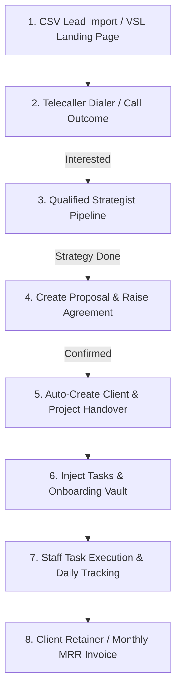

> # ⚠️ HISTORICAL / SUPERSEDED — not the current state
> Dated plan/audit/handoff log, kept for history. **Live build state:** `00_MASTER/FMOS_System_Design_And_Tasks.md` (newest dated entries) + `01_CRM_AND_TOOL/fmos/CONTINUE_HERE.md` (canonical handoff). As of **2026-06-17**: FMOS is **deployed \& live**; Stages 1/3/4 + the AI bot (6.1) + messaging safety/inbox (6.2–6.4) are built; WhatsApp Cloud API live with **33 Meta-approved templates**; the "curiosity" teaser was replaced by the **Direct Report**; team = **Jabeer + Afifa** (delivery via freelancers).

# FortuneMarq Marketing OS (FMOS) — Complete Application & Workflow Report
**Version:** 1.0  
**Date:** June 6, 2026  
**Status:** Verification complete / Ready for Production Setup  

---

## 1. Executive Summary & Overview

### What is FMOS?
**FMOS** (FortuneMarq Marketing Operating System) is a bespoke, enterprise-grade CRM, Project Management, and Fulfillment tracking application built specifically for a digital marketing agency located in **Hubli, Karnataka, India**. 

### The Problem It Solves
Digital marketing agencies targeting small businesses face significant friction in managing cold outreach campaigns, local sales cycles, deal-to-fulfillment handovers, monthly invoice reconciliations, and staff productivity tracking. 

FMOS unifies these disparate operational areas into a single, high-performance web interface. It optimizes:
1. **Sales Pipeline Friction**: Replaces messy spreadsheets with a power dialer queue, dynamic local pitch suggestions, and structured outreach kanban.
2. **Handover Delays**: Automates the transition from "Closed-Won Deal" to "Active Project" by provisioning projects per service and auto-injecting onboarding templates.
3. **Operational Visibility**: Aggregates client health parameters, social content queues, SEO rank tracking, and employee daily targets into centralized dashboards.

---

## 2. User Roles & Access Control

FMOS defines **six user roles** corresponding to the operational stakeholders of the agency. The app enforces role-based navigation and visual access layout.

| User | Role Key | Dashboard URL | Primary Access & Responsibilities |
|---|---|---|---|
| **Jabeer** | `admin` | `/admin` | **Agency Founder & Owner.** Has full system access ("God Mode"). Runs the daily briefing, views global financials (MRR, P&L, expenses), creates proposals/agreements, manages strategy-to-task AI pipeline, sets daily employee targets, and signs off on deliverables. |
| **Afifa** | `telecaller` | `/sales` | **Lead Generation & Sales Specialist.** Operates the Sales Intelligence Cockpit and Dialer. Performs high-velocity dialing, logs call outcomes (connected, follow-up, dead, etc.), sends PDF niche reports, and runs the 7-stage outreach Kanban board to qualify leads. |
| **Zaid** | `staff` | `/staff` | **Specialist / Web Builder.** Responsible for production execution. Accesses a clean, distraction-free dashboard showing only their assigned tasks. Updates task progress and uploads deliverables for Jabeer's review. |
| **Sufiyan** | `staff` | `/staff` | **Specialist / Designer.** Identical role and access profile as Zaid. Executes design and development tasks assigned to them and updates clock hours/attendance. |
| **PM / Head** | `pm` | `/projects` | **Project Manager.** Manages client relationships, monitors team workloads, uploads client asset resources, reviews change requests, and creates manual projects. |
| **Client** | `client` | `/client/dashboard` | **End Customer.** Self-service workspace. Tracks project roadmap, reviews and approves/requests revisions on deliverables, and accesses historical performance reports via secure magic links. |

---

## 3. Directory Structure & App Routing

FMOS is built on **Next.js 16.1.6 (App Router)** and **TypeScript 5.x** with a clean **Professional SaaS Light Theme** (Slate-50 background, White cards, Slate-900 Sidebar, and `#42CA80` brand green accent).

### Route Inventory & Build Status

Below is the complete inventory of all routes inside the `app/` directory, who accesses them, and their verified build status:

| Route / URL | Role / User | Description / Function | Build Status |
|---|---|---|---|
| `/` | *All* | Auth checker & role-based redirect entry point. | ✅ Working |
| `/login` | *All* | Authentication portal (Supabase Auth Client). | ✅ Working |
| `/lp/[niche]/[city]` | *Public* | VSL Landing page. Captures inbound leads. | ✅ Working |
| `/client/dashboard` | `client` | Portal showing project roadmap and approvals. | ✅ Working |
| `/client/report/[token]` | `client` | Monthly public report accessed via magic link token. | ✅ Working |
| `/client-portal/[id]` | `admin`, `pm` | Preview portal for a specific client workspace. | ✅ Working |
| `/telecaller/my-stats` | `telecaller` | Personal stats: daily call numbers, streaks. | ✅ Working |
| `/sales` | `telecaller` | Sales Cockpit & Power Dialer. Step-by-step scripts. | ✅ Working |
| `/sales/outreach` | `telecaller` | 7-Stage Outreach Kanban board (Touch 1 → Proposal). | ✅ Working |
| `/sales/leads/[id]` | `telecaller` | Lead Profile showing timeline and WhatsApp actions. | ✅ Working |
| `/sales/pitch/[industry]/[city]` | `telecaller` | Local pitch suggestion cheat sheet. | ✅ Working |
| `/strategist` | `strategist` | Close deals pipeline, loss reasons, proposal metrics. | ✅ Working |
| `/strategist/deals` | `strategist` | History log of deals marked won or closed. | ✅ Working |
| `/projects` | `admin`, `pm` | Clients/Projects directory. Capacity & workload charts. | ✅ Working |
| `/projects/list` | `admin`, `pm` | Tabular search list of projects. | ✅ Working |
| `/projects/[id]` | `admin`, `pm` | Client Details including asset vaults and AI strategy. | ✅ Working |
| `/tasks` | `admin`, `pm` | Kanban board tracking all open agency tasks. | ✅ Working |
| `/tasks/list` | `admin`, `pm` | Searchable list of open tasks. | ✅ Working |
| `/staff` | `staff` | Personal execution dashboard for Zaid & Sufiyan. | ✅ Working |
| `/attendance` | `staff` | Clock-in, clock-out, and break management tool. | ✅ Working |
| `/admin` | `admin` | God-mode morning Command Center. Operational actions. | ✅ Working |
| `/admin/attendance` | `admin` | Attendance log review for all employees. | ✅ Working |
| `/admin/alerts` | `admin` | Alert rules center (system exceptions, overdue tasks). | ✅ Working |
| `/admin/briefing` | `admin` | Jabeer's Morning Brief summary of metrics. | ✅ Working |
| `/admin/build-tracker` | `admin` | Development progress board for modules. | ✅ Working |
| `/admin/bulk-import` | `admin` | Bulk leads script importer log. | ✅ Working |
| `/admin/data-management` | `admin` | Data clearing, seeding, and table inspections. | ✅ Working |
| `/admin/duplicates` | `admin` | Lead deduplication review panel. | ✅ Working |
| `/admin/niche-kits` | `admin` | Catalog of niche assets and landing pages. | ✅ Working |
| `/admin/operations` | `admin` | Operational analytics (task velocities, call efficiency). | ✅ Working |
| `/admin/sessions` | `admin` | Activity session tracking log. | ✅ Working |
| `/admin/work-hours` | `admin` | Cumulative work hours charts. | ✅ Working |
| `/admin/whatsapp-templates` | `admin` | Master catalogue of approval templates. | ✅ Working |
| `/admin/marketing` | `admin` | Paid Ads budgeting, Content calendar, SEO keyword log. | ✅ Working |
| `/admin/finance` | `admin` | Revenue Dashboard (MRR, Setup, One-time split). | ✅ Working |
| `/admin/finance/invoices` | `admin` | Raise invoices, log payments, generate PDFs. | ✅ Working |
| `/admin/finance/expenses` | `admin` | Log stipend/salary, software, ads, and attrib spend. | ✅ Working |
| `/admin/finance/pnl` | `admin` | P&L Statement (Revenue - Expenses). | ✅ Working |
| `/admin/growth` | `admin` | Organic SEO and Local Acquisition hub. | ✅ Working |
| `/admin/growth/instagram` | `admin` | Instagram content calendar pipeline. | ✅ Working |
| `/admin/growth/linkedin` | `admin` | LinkedIn content calendar pipeline. | ✅ Working |
| `/admin/growth/facebook` | `admin` | Facebook content calendar pipeline. | ✅ Working |
| `/admin/growth/gmb` | `admin` | GMB KPI snapshot, post scheduler, review logs. | ✅ Working |
| `/admin/growth/seo` | `admin` | Keyword density and backlink analytics. | ✅ Working |
| `/admin/growth/acquisition` | `admin` | Multi-city acquisition pipeline. | ✅ Working |
| `/admin/growth/acquisition/[city]`| `admin` | City-specific niche data (digital presence audit). | ✅ Working |
| `/admin/team` | `admin` | Workload list, assign task, set targets modals. | ✅ Working |
| `/admin/team/sops` | `admin` | category-grouped Standard Operating Procedures library. | ✅ Working |
| `/admin/team/sops/new` | `admin` | Create new standard operating procedures. | ✅ Working |
| `/admin/team/sops/[id]` | `admin` | View/Edit an existing SOP card. | ✅ Working |
| `/admin/team/scorecards` | `admin` | Weekly staff target performance scorecards. | ✅ Working |
| `/admin/users` | `admin` | System user logins and role assignments. | ✅ Working |
| `/admin/automations` | `admin` | Automation rule trigger parameters. | ✅ Working |
| `/admin/proposals` | `admin` | Master audit log of client proposals. | ✅ Working |
| `/admin/upload` | `admin` | Smart CSV Lead uploader. | ✅ Working |
| `/admin/upload/history` | `admin` | Log of uploaded CSV files. | ✅ Working |
| `/admin/upload/debug` | `admin` | Uploader parsing debug screens. | ✅ Working |
| `/admin/reports` | `admin` | AI Weekly Agency report creator. | ✅ Working |
| `/admin/strategy` | `admin` | AI strategy parser (paste raw strategy notes). | ✅ Working |
| `/admin/strategy/archive` | `admin` | Strategy history runs log. | ✅ Working |
| `/admin/strategy/review` | `admin` | Strategy task editor before DB insert. | ✅ Working |
| `/admin/leads/[id]` | `admin` | Detailed Admin View of lead metadata. | ✅ Working |
| `/admin/leads/[id]/proposal/new`| `admin` | Create custom client pricing proposal. | ✅ Working |
| `/admin/leads/[id]/proposal/[proposalId]/agreement` | `admin` | Generate service agreement contract. | ✅ Working |
| `/admin/clients/[id]` | `admin` | 6-Tab Profile Details. | ✅ Working |
| `/admin/clients/[id]/reports/new` | `admin` | Raise client reports. | ✅ Working |
| `/admin/outreach` | `admin` | Admin outreach pipeline overview. | ✅ Working |
| `/admin/outreach/pdf-log` | `admin` | Outbound PDF report history. | ✅ Working |
| `/manager/pipeline` | `manager` | Grouped niche CRM pipeline. | ✅ Working |
| `/manager/performance` | `manager` | Telecaller leaderboard. | ✅ Working |

---

## 4. Database Schema

The Supabase PostgreSQL database contains **38 tables**, **4 views**, and **5 custom remote procedure call (RPC) functions**, all fully typed in `types/database.types.ts`.

### Core Tables

#### `leads`
Stores all prospect data.
- **Columns**: `id` (UUID, PK), `company_name` (Text), `phone` (Text), `contact_person` (Text), `industry` (Text, Niche), `city` (Text), `status` (Text), `lead_type` (Text: inbound/outbound), `has_website` (Bool), `website_link` (Text), `gmb_link` (Text), `serp_ranked` (Bool), `serp_source` (Text), `tags` (Text[]), `last_contacted_at` (Timestamptz), `last_outcome` (Text), `next_action_date` (Timestamptz), `attempts` (Int), `notes` (Text), `no_answer_count` (Int).

#### `profiles`
User profiles mapping to Supabase Auth UUIDs.
- **Columns**: `id` (UUID, PK), `email` (Text), `full_name` (Text), `role` (Text: admin, telecaller, strategist, pm, staff, client), `client_id` (UUID), `created_at` (Timestamptz).

#### `clients`
Active legal client entities.
- **Columns**: `id` (UUID, PK), `business_name` (Text), `owner_name` (Text), `primary_email` (Text), `primary_phone` (Text), `city` (Text), `niche` (Text), `status` (Text: onboarding, active, paused, churned), `onboarding_completed` (Bool), `package_tier` (Text: starter, growth, pro, custom), `services_active` (JSONB[]), `monthly_value` (Numeric), `start_date` (Date), `renewal_date` (Date), `notes` (Text).

#### `projects`
Fulfillment projects associated with clients.
- **Columns**: `id` (UUID, PK), `client_id` (UUID, FK), `service_type` (Text), `status` (Text: in_progress, completed, paused), `start_date` (Date), `deadline` (Date), `budget` (Numeric), `drive_link` (Text), `drive_folder_id` (Text).

#### `tasks`
Work action items assigned to users.
- **Columns**: `id` (UUID, PK), `project_id` (UUID, FK), `title` (Text), `description` (Text), `due_date` (Date), `status` (Text: pending, todo, in_progress, in_review, completed, blocked), `priority` (Text: high, medium, low), `assigned_to` (UUID, FK), `section_tag` (Text), `strategy_run_id` (UUID), `estimated_minutes` (Int), `submission_notes` (Text).

#### `follow_ups`
Callback actions scheduled by telecallers.
- **Columns**: `id` (UUID, PK), `lead_id` (UUID, FK), `scheduled_at` (Timestamptz), `status` (Text: pending, completed), `notes` (Text), `type` (Text: call, whatsapp, email).

---

### Sales & Outreach Tables

#### `outreach_sequences`
Tracks the position of a lead inside the 7-stage sales funnel.
- **Columns**: `id` (UUID, PK), `lead_id` (UUID, FK), `stage` (Text: touch1_pending, touch1_sent, pdf_pending, pdf_sent, followup_due, meeting_booked, proposal_sent, won, lost, dead, revival), `touch1_sent_at` (Timestamptz), `touch1_sent_by` (UUID), `pdf_sent_at` (Timestamptz), `pdf_sent_by` (UUID), `pdf_name` (Text), `followup_scheduled_at` (Timestamptz), `meeting_booked_at` (Timestamptz), `meeting_date` (Date), `meeting_booked_by` (UUID), `proposal_sent_at` (Timestamptz), `proposal_sent_by` (UUID), `proposal_type` (Text), `outcome` (Text), `outcome_at` (Timestamptz), `outcome_notes` (Text), `updated_at` (Timestamptz).

#### `pdf_deliveries`
Log of outbound research reports.
- **Columns**: `id` (UUID, PK), `lead_id` (UUID, FK), `sequence_id` (UUID), `pdf_name` (Text), `pdf_type` (Text), `sent_by` (UUID), `delivery_method` (Text), `confirmed_read` (Bool).

#### `meetings`
Outbound sales strategy bookings.
- **Columns**: `id` (UUID, PK), `lead_id` (UUID, FK), `sequence_id` (UUID), `scheduled_at` (Timestamptz), `duration_minutes` (Int), `location` (Text), `conducted_by` (UUID), `booked_by` (UUID), `status` (Text), `outcome` (Text), `rescheduled_to` (Timestamptz).

#### `proposals`
Customer pricing packages.
- **Columns**: `id` (UUID, PK), `lead_id` (UUID, FK), `sequence_id` (UUID), `proposal_number` (Text), `proposal_type` (Text), `services` (JSONB), `total_setup` (Numeric), `total_monthly` (Numeric), `start_date` (Date), `status` (Text: draft, sent, confirmed, rejected), `created_by` (UUID).

#### `agreements`
Legally confirmed packages waiting execution.
- **Columns**: `id` (UUID, PK), `lead_id` (UUID, FK), `proposal_id` (UUID, FK), `agreement_number` (Text), `proposal_ref` (Text), `services` (JSONB), `total_setup` (Numeric), `total_monthly` (Numeric), `start_date` (Date), `status` (Text: pending, confirmed, cancelled), `confirmed_at` (Timestamptz), `created_by` (UUID).

#### `outreach_logs`
Historic logger for all outreach interactions.
- **Columns**: `id` (UUID, PK), `lead_id` (UUID, FK), `touch_type` (Text: call, whatsapp_sent, pdf_sent, email_sent), `outcome` (Text), `pdf_name` (Text), `notes` (Text), `actor_id` (UUID), `created_at` (Timestamptz).

---

### Finance & Operations Tables

#### `invoices`
Client monthly billing.
- **Columns**: `id` (UUID, PK), `invoice_number` (Text), `client_id` (UUID, FK), `issue_date` (Date), `due_date` (Date), `status` (Text: unpaid, paid, overdue, cancelled), `subtotal` (Numeric), `gst_amount` (Numeric), `total_amount` (Numeric), `paid_at` (Timestamptz), `paid_amount` (Numeric), `revenue_type` (Text: mrr, setup_fee, one_time), `notes` (Text), `pdf_url` (Text), `created_by` (UUID).

#### `expenses`
Payout allocations.
- **Columns**: `id` (UUID, PK), `expense_date` (Date), `category` (Text: Ad Spend, Subscription, Stipend/Salary, Office, Tools & Software, Misc), `description` (Text), `amount` (Numeric), `client_id` (UUID, FK), `is_recurring` (Bool), `created_by` (UUID).

#### `attendance_sessions` & `attendance_breaks`
Tracks clocking and breaks.
- **Sessions**: `id` (UUID, PK), `user_id` (UUID), `clock_in_at` (Timestamptz), `clock_out_at` (Timestamptz), `status` (Text: open, closed).
- **Breaks**: `id` (UUID, PK), `session_id` (UUID), `break_start_at` (Timestamptz), `break_end_at` (Timestamptz).

---

## 5. End-to-End Operational Workflows

### Workflow 1: Lead Import & Dialing Loop
1. **Importing**: Admins upload CSV files in `/admin/upload` containing business metrics (Name, Phone, City, Website, SERP ranking).
2. **Auto-Sequence**: A PostgreSQL database trigger `trg_init_outreach` fires on insert, auto-creating a tracking sequence in `outreach_sequences` at `touch1_pending` stage.
3. **Queue Distribution**: Telecaller Afifa logs in to `/sales`. The script engine auto-detects the script type (A, B, C, D) using tags (e.g. "SERP Ranked" = Type A).
4. **Step-by-step Calling**: Afifa calls the lead via the large phone click target. The UI displays script lines step-by-step. If they object, she expands the objection accordion to view local rebuttals.
5. **Outcome Logging**: Clicking "Log Outcome" opens a modal overlay with 9 outcomes.
   - If `NO_ANSWER`, `no_answer_count` increments on the lead.
   - If `INTERESTED_SEND_INFO`, a PDF selector opens (`[city]_[niche]_EN.pdf`).
   - If `INTERESTED_BOOK`, the scheduler opens to book a meeting.
   - Updates are saved to `leads` and logged in `outreach_logs`. The UI auto-advances to the next lead.

---

### Workflow 2: PDF & WhatsApp Sending
1. **Trigger**: During outcome logging or when a lead is in `pdf_pending`, the telecaller clicks "Open WhatsApp Templates".
2. **Substitution**: The picker dynamically substitues variables (`{{businessName}}`, `{{city}}`, `{{niche}}`) from the active lead data.
3. **Clipboard Copy**: The telecaller copies the message, fires the API link, and pastes the message in WhatsApp Web.
4. **Sent Audit**: Clicking "Mark as Sent" registers a `whatsapp_sent` type log in `outreach_logs` for tracking.

---

### Workflow 3: Closing a Deal & Client Onboarding
1. **Meeting**: Sales meetings are booked in `meetings` at `scheduled` status.
2. **Proposal**: In `/admin/leads/[id]/proposal/new`, Jabeer customizes setup fees and monthly retainers per service. Saving sets the proposal to `draft`. Marking it sent advances the lead to `proposal_sent`.
3. **Agreement**: Once the client confirms, Jabeer opens `/admin/leads/[id]/proposal/[proposalId]/agreement`. He generates the agreement document (starts at `pending` status).
4. **Closing**: When the agreement is marked "Confirmed", a transactional block executes:
   - Proposal status updates to `confirmed`, and agreement status changes to `confirmed`.
   - Lead status becomes `closed_won` and outreach stage becomes `won`.
   - A client record is created in `clients` with status `onboarding`.
   - Monthly value is populated, and package tier is computed (Starter vs Pro).
   - `generateClientOnboarding` generates onboarding task items and asset folders in the database.
   - Jabeer is redirected to the client profile's Onboarding checklist page.

---

### Workflow 4: Fulfillment Handover
1. **Project Splitting**: Creating a client automatically provisions one project per service. If Jabeer selected "SEO" and "Web Dev", two projects are added.
2. **Onboarding Checklist**: Zaid/Sufiyan see the onboarding tasks in `/admin/clients/[id]?tab=onboarding` divided by service.
3. **Asset Vault**: Critical credentials (domains, hostings, logos) are tracked in `client_asset_vault`. Staff mark assets as "Requested" or "Received" as they are collected.

---

### Workflow 5: Finance & Forecasting
1. **Invoice Split**: Invoices are raised under three categories (`revenue_type`): `mrr` (recurring), `setup_fee` (one-time onboarding), and `one_time` (ad-hoc work).
2. **P&L Engine**: `/admin/finance/pnl` filters invoices by paid status and type. Net margins are computed as `Paid Revenue - Logged Expenses`.
3. **Pacing Widget**: The dashboard displays a widget calculating MRR against a ₹50,000 baseline, plus a 30% pipeline forecast from sent proposals.
4. **Reminders**: On the 1st-5th of each month, an alert banner is displayed reminding the admin to raise monthly recurring invoices.

---

### Workflow 6: Strategy-to-Task AI Engine
1. **Extraction**: In `/admin/strategy`, Jabeer pastes a raw strategy markdown text (e.g. from Claude).
2. **Prompting**: An Anthropic Claude model is triggered, extracting tasks with title, due date, assignee, and priority, returning a JSON array.
3. **Review**: The parsed JSON is loaded in `/admin/strategy/review` for edit.
4. **Commit**: Approving inserts tasks into the database, linked to a specific client project or saved as "pending" strategy tasks with `section_tag` headers (e.g., GMB checklist).

---

## 6. Known Code Issues & Security Vulnerabilities

By reading the actual implementation code, several vulnerabilities and structural gaps were identified:

### 1. Missing Route-Level Authentication & Authorization (Critical)
*   **Detail**: The application does not contain a global `middleware.ts` file. 
*   **Impact**: While the sidebar navigation links are hidden based on the user's role (e.g., staff only see the tasks link), there is no route-level restriction. An authenticated telecaller or staff member can access `/admin`, `/admin/finance`, or `/admin/upload` by typing the path directly in the browser's address bar. RLS policy protects database operations, but pages themselves render.

### 2. Browser-Side Exposure of Anthropic API Key (High)
*   **Detail**: In `components/admin/strategy/StrategyPastePanel.tsx`, the application requires the user to input their Anthropic API Key, saving it in the browser's `sessionStorage`. It then uses `anthropic-dangerous-direct-browser-access: true` to trigger fetch requests to Anthropic from the browser.
*   **Impact**: Exposing raw API keys in browser memory violates security standards. In production, this call must be proxy-routed through a Next.js Server Action or secure endpoint.

### 3. Hardcoded Search Volume Variable (Medium)
*   **Detail**: In `whatsapp-template-picker.tsx` line 48, the substitute variables function completely overrides any dynamic search volume calculations by hardcoding `{{searchVolume}}` to `"2,400"`.
*   **Impact**: Leads will receive WhatsApp templates showing inaccurate search volumes instead of dynamic data parsed from the `market_insights` table.

### 4. Client Portal Session Fallback (Low)
*   **Detail**: In `app/page.tsx` line 51, if a client attempts to log in but does not have a profile row in the `profiles` table, the system checks `clients.primary_email = user.email` and sets role to `client` as a fallback. 
*   **Impact**: Client users logging in without an explicit `profiles` row will fail queries that join tasks or audits on `profiles.id`, leading to potential dashboard rendering errors.

---

## 7. Production Readiness Checklist

Before onboarding real clients and adding users to FMOS, the following tasks must be completed:

- [ ] **1. Implement Route-Level Middleware**  
  Create a global `middleware.ts` in the Next.js root folder. Deny access to `/admin/*` routes for users whose profile role is not `admin`. Deny access to `/strategist/*` for non-strategists.
- [ ] **2. Refactor AI Strategy Calls to Server Actions**  
  Remove the `sessionStorage` Anthropic key requirement. Store `ANTHROPIC_API_KEY` as a secure environment variable on the server side and call Claude inside a Next.js Server Action (`"use server"`).
- [ ] **3. Fix Variable Hardcoding in WhatsApp Template Picker**  
  Resolve the hardcoded `2,400` replace function in `whatsapp-template-picker.tsx` and map it to the lead's associated niche search volume in the database.
- [ ] **4. Enable/Review Database RLS Policies**  
  Confirm that all tables created in migrations have active Row Level Security (RLS) policies. Verify that telecallers cannot update financials and staff can only read/edit tasks assigned to them.
- [ ] **5. Test client portal auth flow**  
  Create a test client user in Supabase Auth, verify they are redirected to `/client/dashboard`, and confirm they cannot load PM or Admin views.
